# relational databases :
### A relational database is a type of database. It uses a structure that allows us to identify and access data in relation to another piece of data in the database. Often, data in a relational database is organized into tables.
 

# SQL :
### SQL (Structured Query Language) is a programming language used to communicate with data stored in a relational database management system. SQL syntax is similar to the English language, which makes it relatively easy to write, read, and interpret.
 

### Many RDBMSs use SQL (and variations of SQL) to access the data in tables. For example, SQLite is a relational database management system. SQLite contains a minimal set of SQL commands (which are the same across all RDBMSs). Other RDBMSs may use other variants.

 

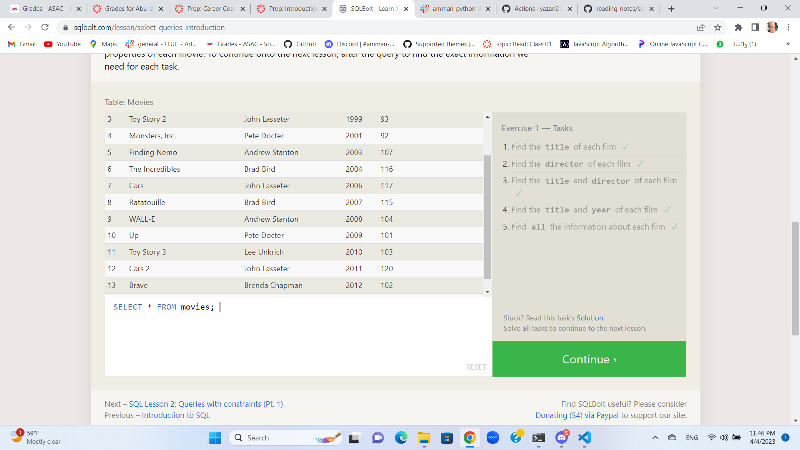
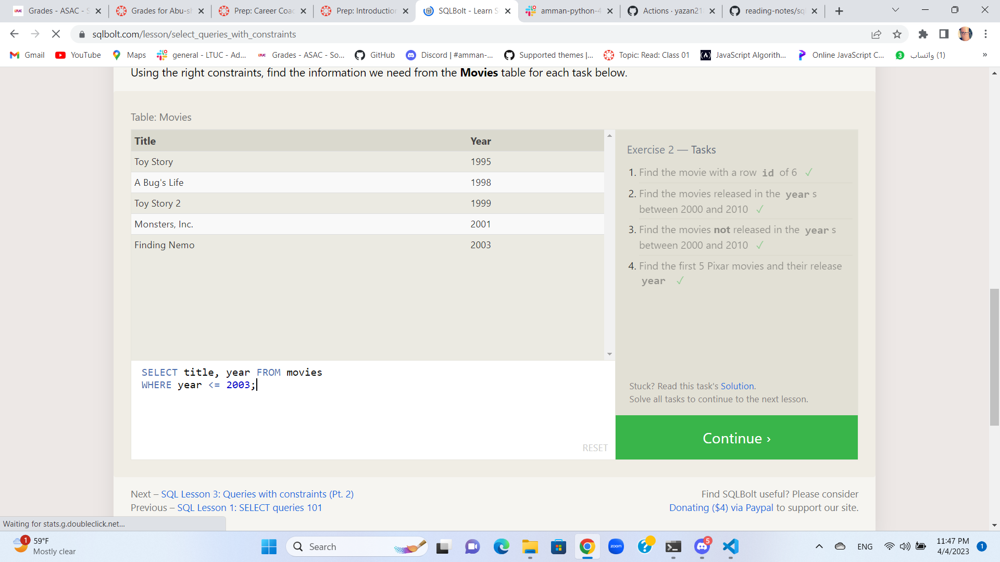
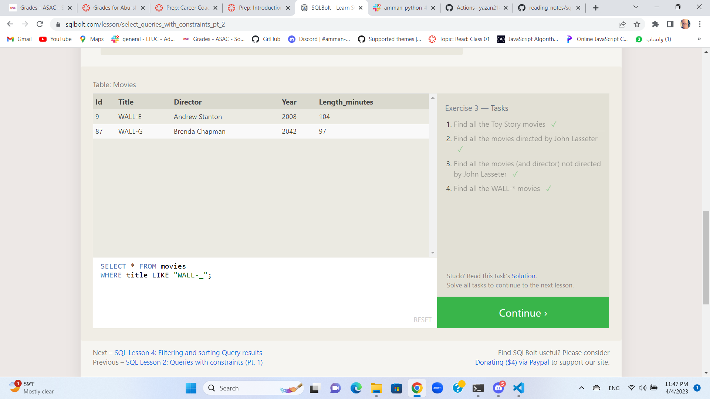
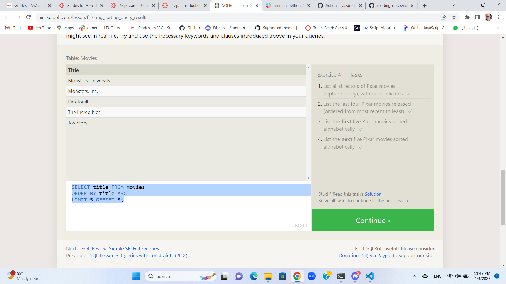
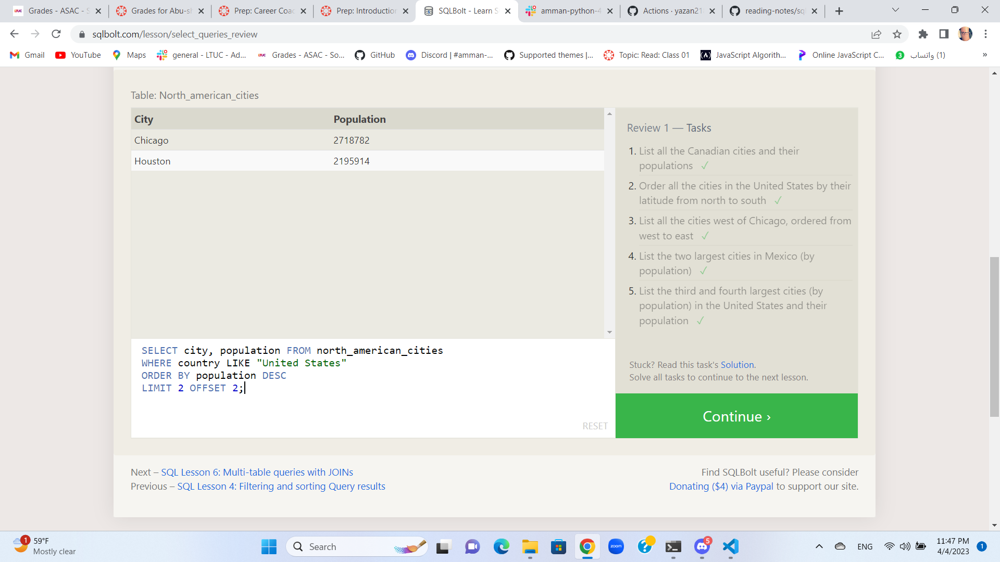
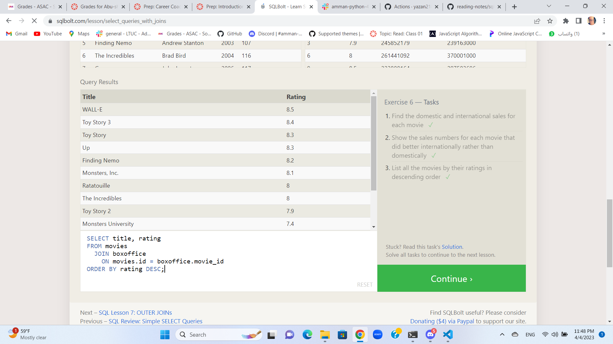
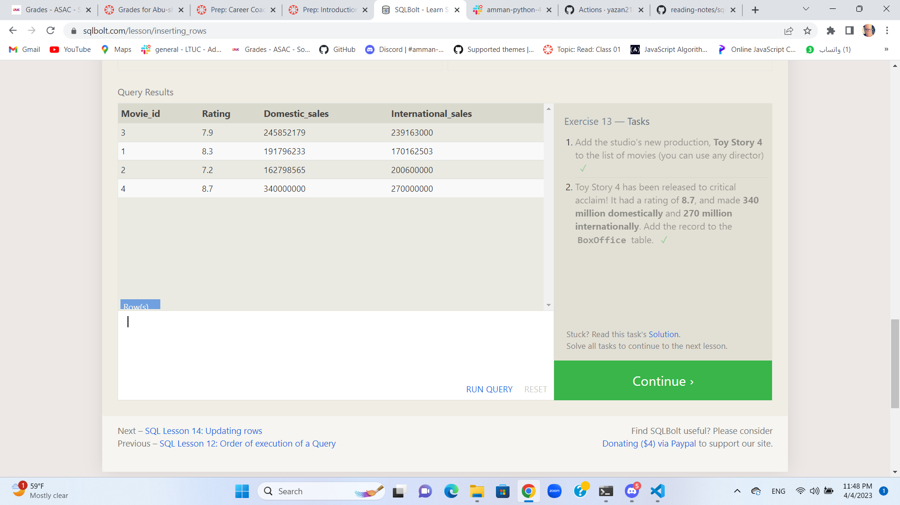
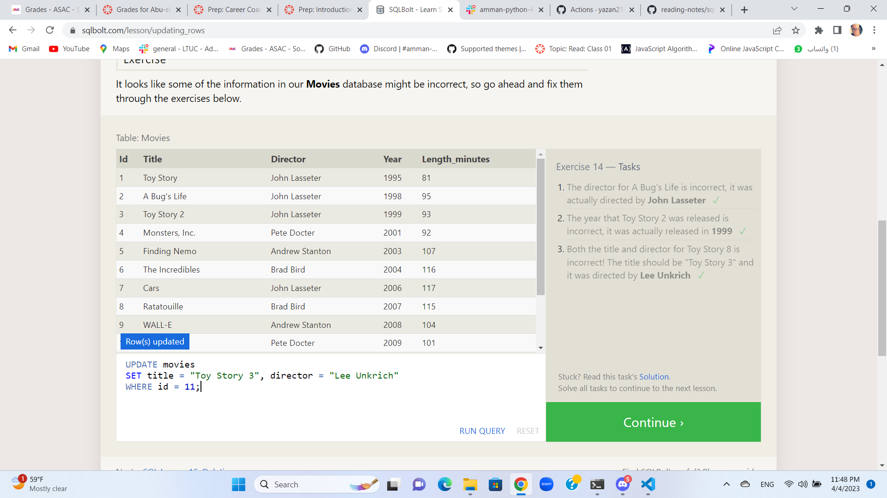
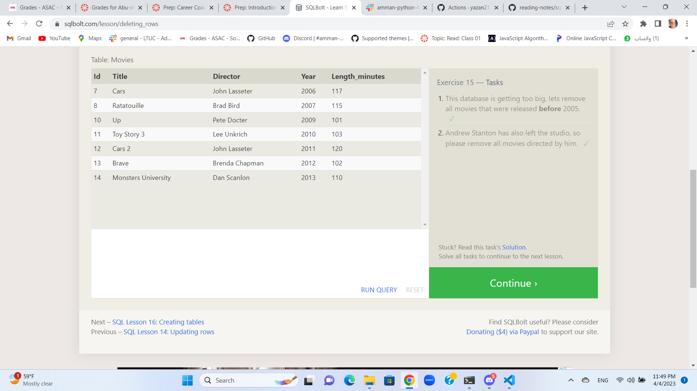
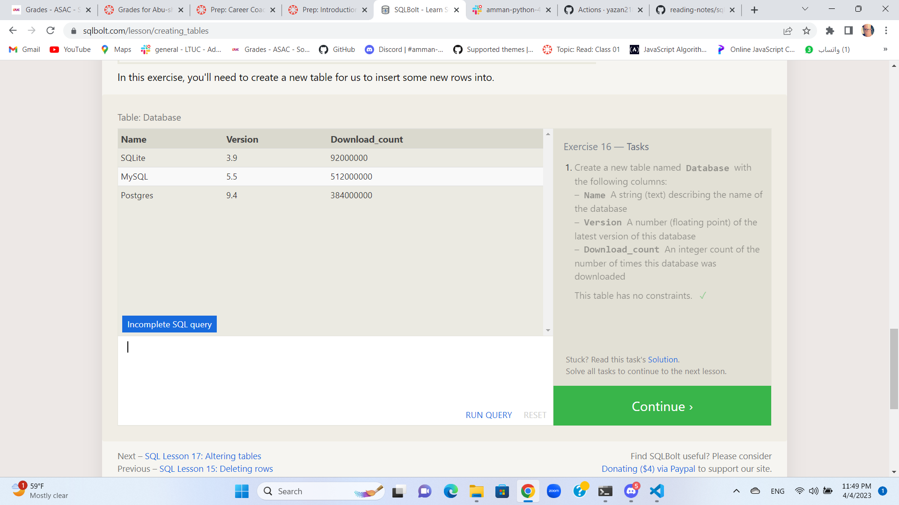
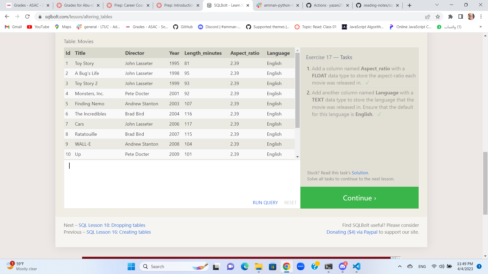

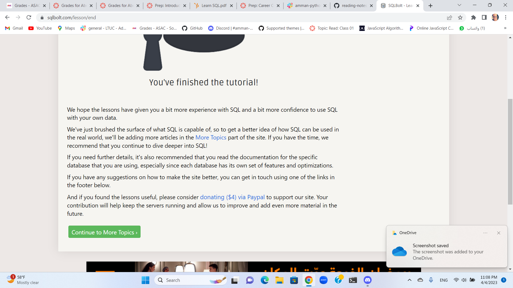
